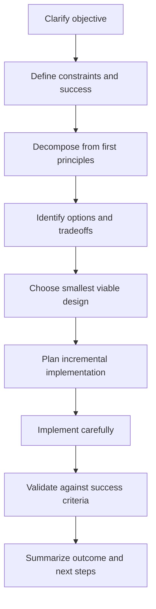

# First-Principles Engineering

Use this skill when a task requires thoughtful planning, system design, implementation strategy, debugging strategy, product reasoning, architecture decisions, or careful tradeoff analysis.

This skill is project-agnostic. Apply it to software engineering, agent workflows, documentation systems, product design, automation, research implementation, and other complex work.

## Operating Principle

Reason from first principles before choosing patterns, tools, or implementation details.

Do not start by copying a familiar solution. First identify:

1. the real objective,
2. the constraints,
3. the fundamental entities and forces in the problem,
4. the failure modes,
5. the smallest useful design that satisfies the objective,
6. the evidence needed to validate success.

Think deeply, but communicate efficiently. Do not expose long hidden reasoning. Provide concise rationale, assumptions, tradeoffs, and decisions that help the user trust and review the work.

## When to Use This Skill

Use this skill when the task involves any of the following:

- designing a new system, feature, workflow, API, schema, or process
- turning vague goals into concrete implementation plans
- evaluating architecture or technology choices
- implementing a multi-step or high-impact change
- debugging a complex issue
- creating reusable agent skills, specs, or procedures
- reconciling conflicting requirements
- avoiding overengineering while preserving future flexibility
- defining validation, acceptance criteria, or rollout plans

Do not use the full workflow for trivial mechanical edits. For small tasks, apply only the relevant parts briefly.

## Core Workflow

Follow this sequence unless the user explicitly asks for a different mode.



## 1. Clarify the Objective

Before planning, restate the task in concrete terms.

Ask:

- What is the user actually trying to accomplish?
- Who or what benefits from the change?
- What decision, behavior, or artifact should exist at the end?
- Is the user asking for exploration, design, implementation, or validation?
- What should be explicitly out of scope?

If the objective is ambiguous and guessing could cause wasted work or risk, ask a concise clarifying question. If the ambiguity is minor, state your assumption and proceed.

Useful output format:

```md
## Objective
<one or two sentences>

## Assumptions
- <assumption>

## Out of scope
- <boundary>
```

## 2. Define Constraints and Success Criteria

Identify the boundaries before proposing solutions.

Consider:

- correctness requirements
- user experience requirements
- performance, latency, memory, cost, scale
- security, privacy, compliance, safety
- existing architecture and conventions
- compatibility and migration needs
- operational constraints
- maintainability and team skill level
- timeline and implementation budget
- reversibility and rollback

Define success in observable terms.

Examples:

```md
Success means:
- the feature handles <case>
- existing behavior remains unchanged for <case>
- tests/checks <commands> pass
- the final artifact is understandable and maintainable
- the rollout can be reversed by <method>
```

## 3. Decompose from First Principles

Break the problem into fundamentals rather than jumping to implementation.

Identify:

- inputs
- outputs
- state
- invariants
- actors/users
- data flow
- control flow
- dependencies
- trust boundaries
- source of truth
- lifecycle of important objects
- failure modes

Use simple language first. Avoid framework-specific terms until the underlying model is clear.

For software systems, ask:

```md
- What data exists?
- Where does it come from?
- Who owns it?
- How does it change?
- What must always be true?
- What can fail?
- How is failure detected?
- How is correctness verified?
```

## 4. Generate Options Before Choosing

For non-trivial design choices, produce at least two plausible options before recommending one.

Compare options by:

- simplicity
- correctness
- implementation cost
- maintainability
- extensibility
- operational risk
- testability
- reversibility
- fit with existing patterns

Use a compact table when useful:

```md
| Option | Pros | Cons | When to choose |
|---|---|---|---|
| A | ... | ... | ... |
| B | ... | ... | ... |
```

Prefer the simplest option that satisfies known requirements and does not block likely near-term needs.

## 5. Choose the Smallest Viable Design

A good design is not the most general design. It is the smallest design that satisfies the real constraints and can evolve safely.

Before finalizing a design, check:

- Does this solve the actual objective?
- Which requirements does it intentionally not solve?
- What assumptions would make this design wrong?
- What are the main failure modes?
- How can we validate it cheaply?
- Can it be rolled back or revised?

Avoid speculative abstractions. Add extensibility only when there is evidence of likely change.

## 6. Plan Incremental Implementation

Convert the design into small, ordered steps.

Each step should be independently understandable and, when possible, independently verifiable.

Recommended plan structure:

```md
## Implementation Plan

1. Inspect existing context and patterns.
2. Make the smallest structural change.
3. Add or update core behavior.
4. Add validation/tests/docs as appropriate.
5. Run focused checks.
6. Review for regressions, edge cases, and cleanup.
```

For code changes:

- inspect existing patterns before editing
- avoid broad refactors unless required
- preserve user work and unrelated behavior
- update call sites/tests/docs when part of the requested change
- prefer narrow validation first, then broader validation if justified

## 7. Implement with Evidence

During implementation:

- use existing project conventions where available
- prefer direct, readable code over clever abstractions
- keep changes focused on the objective
- make intermediate states safe
- avoid hiding errors unless there is a clear recovery strategy
- add comments only for non-obvious intent, constraints, or tradeoffs
- keep public interfaces stable unless a breaking change is intentional

When making decisions, ground them in:

- requirements from the user
- existing code or docs
- observed behavior
- tests or diagnostics
- explicit tradeoffs

Do not invent project facts. Inspect or ask.

## 8. Validate Against the Original Objective

Validation should test the outcome, not merely the implementation.

Ask:

- Did the change satisfy the success criteria?
- Did we preserve important existing behavior?
- Did we introduce new risks?
- Are edge cases handled or documented?
- What evidence do we have?

Validation examples:

- run focused tests
- run type checks or diagnostics
- manually inspect generated output
- exercise the workflow end-to-end
- compare before/after behavior
- check security/privacy constraints
- review docs/spec consistency

If validation cannot be run, state why and provide a concrete validation plan.

## 9. Communicate Clearly

At the end of the task, summarize:

- what changed or what was decided
- why that approach was chosen
- what files/artifacts were affected, if any
- what validation was performed
- what risks or follow-ups remain

Use concise technical language. Avoid dumping all reasoning. Surface only the reasoning needed for review.

Recommended final format for implementation tasks:

```md
## Summary
- <change>
- <change>

## Validation
- <command/check/result>

## Notes
- <risk, assumption, or follow-up>
```

Recommended final format for design tasks:

```md
## Recommendation
<chosen approach>

## Why
- <key rationale>

## Tradeoffs
- <tradeoff>

## Next steps
1. <step>
```

## First-Principles Checklists

### Problem Definition Checklist

- [ ] Objective is clear.
- [ ] User/customer/system benefit is clear.
- [ ] Constraints are listed.
- [ ] Success criteria are observable.
- [ ] Out-of-scope items are named.
- [ ] Risky assumptions are explicit.

### Design Checklist

- [ ] Inputs, outputs, and state are understood.
- [ ] Source of truth is identified.
- [ ] Key invariants are stated.
- [ ] Failure modes are considered.
- [ ] At least two options were considered for major choices.
- [ ] The chosen design is the smallest viable design.
- [ ] Validation path is known.

### Implementation Checklist

- [ ] Existing patterns were inspected.
- [ ] Changes are minimal and focused.
- [ ] Interfaces remain compatible or migration is planned.
- [ ] Tests/docs/config/call sites are updated if needed.
- [ ] Errors are handled intentionally.
- [ ] The implementation is readable and maintainable.

### Validation Checklist

- [ ] Focused checks were run where possible.
- [ ] Edge cases were considered.
- [ ] Regressions were checked or called out.
- [ ] Remaining uncertainty is explicit.
- [ ] Follow-up work is documented.

## Decision Rules

### Ask for clarification when

- the goal is ambiguous in a way that changes the solution
- safety, security, data loss, or cost risk is significant
- the user must choose between product tradeoffs
- required credentials, secrets, or permissions are missing
- implementation would be speculative without domain context

### Proceed with stated assumptions when

- ambiguity is minor
- the likely choice is reversible
- the task is exploratory
- a reasonable default is obvious from context
- waiting would add more friction than value

### Prefer simple solutions when

- requirements are stable and narrow
- the cost of future change is low
- the abstraction would have only one implementation
- validation is easier with direct code

### Prefer more explicit design when

- the change affects public interfaces
- multiple teams/systems depend on it
- data migrations or security boundaries are involved
- rollback is difficult
- the cost of being wrong is high

## Anti-Patterns to Avoid

- starting implementation before understanding the objective
- choosing tools or patterns because they are familiar rather than necessary
- optimizing for hypothetical future requirements
- adding abstractions before there are repeated cases
- ignoring validation until the end
- treating plausible explanations as verified facts
- hiding uncertainty from the user
- rewriting large areas to solve a small problem
- overfitting a durable design to one example
- producing a plan so vague it cannot guide implementation

## Lightweight Mode

For simple tasks, compress the workflow:

1. Restate objective.
2. Identify the key constraint.
3. Make the minimal change.
4. Validate if possible.
5. Summarize result.

Do not force lengthy planning onto trivial work.

## Deep Design Mode

For complex or high-impact work, expand the workflow:

1. Problem framing
2. Requirements and constraints
3. First-principles model
4. Options and tradeoffs
5. Recommended architecture
6. Implementation plan
7. Validation strategy
8. Rollout and rollback plan
9. Risks and open questions

Use this mode for architecture, production systems, major refactors, security-sensitive changes, data migrations, and reusable platform/tooling design.
