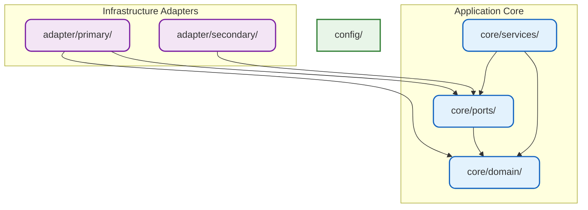

# Architecture

This project follows **Hexagonal Architecture** (also known as **Ports & Adapters**), originally introduced by Alistair Cockburn.

The goal is to create a clean, maintainable, and technology-independent core that is easy to test and evolve over time.

## Core Principles

- The **domain** is the heart of the application and must remain pure.
- All dependencies must point **inward** toward the domain.
- External concerns (databases, HTTP, external APIs, etc.) are pushed to the edges (adapters).
- The core never depends on frameworks or infrastructure.

## Layer Responsibilities

### `core/domain/`

- Contains business entities, value objects, and domain rules.
- Completely independent — no imports from any other internal package.
- Represents the business language and invariants of the system.

### `core/ports/`

- Defines **interfaces** (contracts) between the core and the outside world.
- `core/ports/primary/` — Driving ports (inbound): what the outside world can ask the application to do (use cases).
- `core/ports/secondary/` — Driven ports (outbound): what the application needs from external systems.

### `core/services/`

- Implements application use cases and orchestrates domain logic.
- Depends only on `core/domain/` and `core/ports/`.
- Contains workflow logic, transaction management, and coordination.

### `adapter/`

- Contains all concrete implementations.
- `adapter/primary/` — Inbound adapters (HTTP handlers, CLI, gRPC servers, etc.).
- `adapter/secondary/` — Outbound adapters (database repositories, external APIs, caches, etc.).
- Translates between external world and the port interfaces.

### `config/`

- Centralizes configuration structures and loading logic.
- Used primarily by primary adapters.

## Dependency Graph

