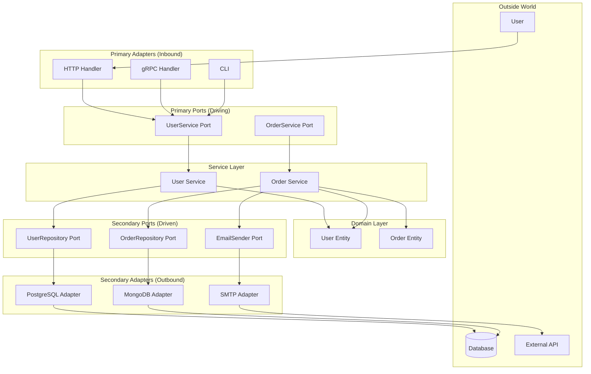
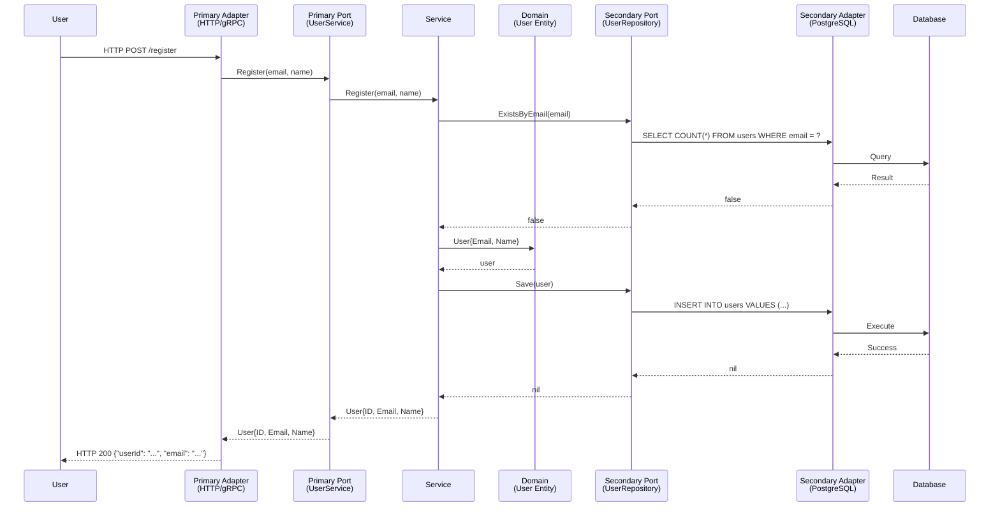
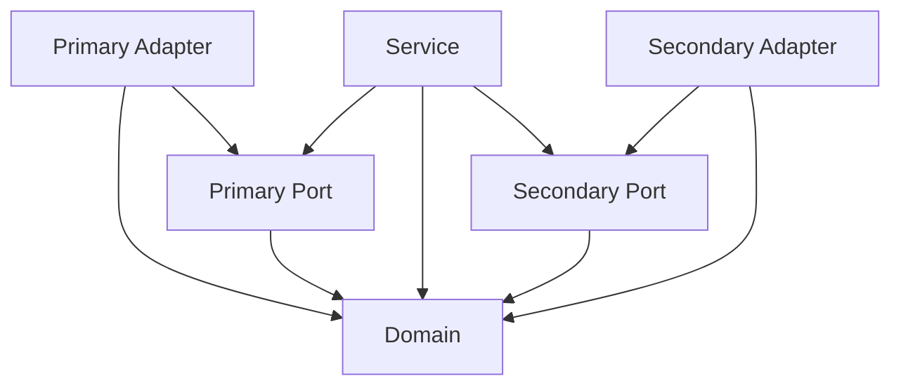

# Hexagonal Architecture - Simplified

**A beginner-friendly guide to Ports, Adapters, Domain, and Service**

---

## The Big Picture

Imagine your application is like a restaurant:

- **Domain** = The food and recipes (what you actually serve)
- **Primary Ports** = The menu (what customers can order)
- **Secondary Ports** = The shopping list (what the kitchen needs)
- **Primary Adapters** = Waiters (take orders from customers)
- **Secondary Adapters** = Suppliers (grocery stores, delivery services)
- **Service** = The chef (coordinates everything and makes the food)

The following diagram shows **runtime control flow**. The dependency rules are shown separately later in this guide.



---

## Layer by Layer

### 1. Domain (The Heart)

**What it is:** Pure business logic and data structures.

**What it knows:** Nothing about the outside world. No databases, no HTTP, no APIs.

**What it does:** Defines what "User", "Order", "Product" mean and what rules they follow.

```go
// internal/core/domain/user.go
type User struct {
    ID       UserID
    Email    string
    Name     string
    IsActive bool
}

func (u *User) Activate() error {
    if u.IsActive {
        return errors.New("user already active")
    }
    u.IsActive = true
    return nil
}
```

**Like:** The recipes and ingredients. They exist regardless of who orders them or how they're delivered.

---

### 2. Ports (The Interfaces)

Ports are just empty contracts - they say "something needs to provide this capability" but don't say how.

#### Primary Ports (Driving Ports)

**What they are:** What the outside world can ask your application to do.

**Direction:** Outside → Inside

**Example:**

```go
// internal/core/ports/primary/user_service.go
type UserService interface {
    // A user wants to sign up
    Register(ctx context.Context, cmd RegisterUserCommand) (User, error)

    // A user wants to see their profile
    GetProfile(ctx context.Context, id UserID) (UserProfile, error)

    // A user wants to change their name
    UpdateName(ctx context.Context, id UserID, name string) error
}
```

**Like:** A restaurant menu. It tells customers what they can order, but doesn't say how the kitchen makes it or where ingredients come from.

#### Secondary Ports (Driven Ports)

**What they are:** What your application needs from the outside world to do its job.

**Direction:** Inside → Outside

**Example:**

```go
// internal/core/ports/secondary/user_repository.go
type UserRepository interface {
    // I need to save a user somewhere
    Save(ctx context.Context, user *User) error

    // I need to find a user by ID
    FindByID(ctx context.Context, id UserID) (*User, error)

    // I need to check if an email is already taken
    ExistsByEmail(ctx context.Context, email string) (bool, error)
}
```

**Like:** A shopping list. The app says "I need these things to do my job."

- "Save" = "I need somewhere to store this user"
- "FindByID" = "I need to find users by their ID"
- "ExistsByEmail" = "I need to check if an email is already taken"

The app doesn't care who provides these - could be PostgreSQL, MongoDB, or even a text file. It just says "I need these capabilities."

---

### 3. Service (The Brain)

**What it is:** The application logic that coordinates everything.

**What it does:** Takes requests from primary ports, uses domain entities, and calls secondary ports to get things done.

```go
// internal/core/services/user_service.go
type UserServiceImpl struct {
    userRepo UserRepository  // Secondary port - I need this to save users
    emailSender EmailSender // Secondary port - I need this to send emails
}

func (s *UserServiceImpl) Register(ctx context.Context, cmd RegisterUserCommand) (User, error) {
    // 1. Check if email already exists
    exists, err := s.userRepo.ExistsByEmail(ctx, cmd.Email)
    if err != nil {
        return User{}, err
    }
    if exists {
        return User{}, errors.New("email already taken")
    }

    // 2. Create the user (domain logic)
    user := User{
        Email: cmd.Email,
        Name:  cmd.Name,
    }

    // 3. Save the user (secondary port)
    err = s.userRepo.Save(ctx, &user)
    if err != nil {
        return User{}, err
    }

    // 4. Send welcome email (secondary port)
    if err := s.emailSender.SendWelcomeEmail(ctx, user.Email); err != nil {
        return User{}, err
    }

    return user, nil
}
```

**Like:** The chef who takes the order, checks the shopping list, uses the recipes, and coordinates with suppliers to get the job done.

**Important rules:**

- Can depend on `core/domain/` and `core/ports/`
- Cannot depend on `adapter/` (that would be cheating!)
- Uses ports, not concrete implementations

---

### 4. Adapters (The Connectors)

Adapters are the concrete implementations that plug into ports and connect to the real world.

#### Primary Adapters (Inbound)

**What they are:** Things that receive requests from the outside and call primary ports.

**Examples:** HTTP handlers, gRPC servers, CLI commands

```go
// internal/adapter/primary/grpc_user_service.go
type GRPCUserService struct {
    userService port.UserService // Primary port - this is what I call
}

func (g *GRPCUserService) Register(ctx context.Context, req *pb.RegisterRequest) (*pb.RegisterResponse, error) {
    // 1. Convert gRPC request to command
    cmd := port.RegisterUserCommand{
        Email: req.Email,
        Name:  req.Name,
    }

    // 2. Call the primary port
    user, err := g.userService.Register(ctx, cmd)
    if err != nil {
        return nil, err
    }

    // 3. Convert domain user to gRPC response
    return &pb.RegisterResponse{
        UserId: user.ID.String(),
        Email:  user.Email,
    }, nil
}
```

**Like:** A waiter who takes your order and gives it to the kitchen.

#### Secondary Adapters (Outbound)

**What they are:** Things that implement secondary ports and connect to external systems.

**Examples:** PostgreSQL adapter, MongoDB adapter, SMTP adapter, HTTP client

```go
// internal/adapter/secondary/postgres_user_repository.go
type PostgresUserRepository struct {
    db *sql.DB
}

func (r *PostgresUserRepository) Save(ctx context.Context, user *User) error {
    _, err := r.db.ExecContext(ctx,
        "INSERT INTO users (id, email, name) VALUES ($1, $2, $3)",
        user.ID, user.Email, user.Name,
    )
    return err
}

func (r *PostgresUserRepository) FindByID(ctx context.Context, id UserID) (*User, error) {
    var user User
    err := r.db.QueryRowContext(ctx, "SELECT id, email, name FROM users WHERE id = $1", id).
        Scan(&user.ID, &user.Email, &user.Name)
    if err != nil {
        return nil, err
    }
    return &user, nil
}
```

**Like:** The grocery store or delivery service that actually provides the ingredients. The chef asked for "milk" on the shopping list - this adapter is the one that delivers it (whether from a supermarket, farm, or warehouse).

---

## How They All Connect



---

## The Golden Rules

### Dependency Direction



**These arrows are compile-time dependencies (Go imports), not runtime call order.** Runtime control enters through a primary adapter, is dispatched through a primary port to a service, and leaves through a secondary port implemented by a secondary adapter. The service imports port contracts; the ports never import the service or adapters.

### What Each Layer Can Depend On

| Layer | Allowed project dependencies | External dependencies |
| --- | --- | --- |
| **Domain** | None | Standard library only |
| **Primary/secondary port** | Domain | Standard library only |
| **Service** | Domain, primary ports, secondary ports | Standard library only |
| **Primary adapter** | Domain, primary ports, config | Allowed |
| **Secondary adapter** | Domain, secondary ports | Allowed |
| **Config** | None | Standard library only |

### Why This Matters

1. **Easy to test:** You can mock ports and test services without real databases
2. **Easy to change:** Swap PostgreSQL for MongoDB by changing one adapter
3. **Easy to understand:** Domain logic stays pure, not mixed with HTTP/SQL
4. **Easy to scale:** Add new adapters (Kafka, Redis) without touching core logic

---

## Quick Reference

### Primary Port = Menu

- "Here's what you can ask me to do"
- Outside world calls this
- Implemented by service

### Secondary Port = Shopping List

- "Here's what I need you to do for me"
- Service calls this
- Implemented by adapter

### Service = Chef

- Takes orders from primary ports (menu)
- Uses domain entities (recipes)
- Calls secondary ports (shopping list)
- Coordinates everything

### Adapter = Connector

- Primary adapter = Waiter (receives outside requests)
- Secondary adapter = Supplier (provides what's on the shopping list)

### Domain = Recipes & Ingredients

- Business rules and entities
- No outside dependencies
- The heart of your application

---

## Real-World Example: User Registration

1. **User** sends HTTP POST to `/register`
2. **Primary Adapter** (HTTP handler) receives request
3. **Primary Adapter** calls **Primary Port** (UserService.Register)
4. **Service** checks if email exists via **Secondary Port** (UserRepository.ExistsByEmail)
5. **Secondary Adapter** (PostgreSQL) queries database
6. **Service** creates **Domain** entity (User)
7. **Service** saves user via **Secondary Port** (UserRepository.Save)
8. **Secondary Adapter** (PostgreSQL) inserts into database
9. **Service** returns success
10. **Primary Adapter** returns HTTP 200

**Key point:** The service never knows it's using PostgreSQL. It just calls the port. The adapter could be MongoDB, Redis, or even a text file - the service doesn't care!
